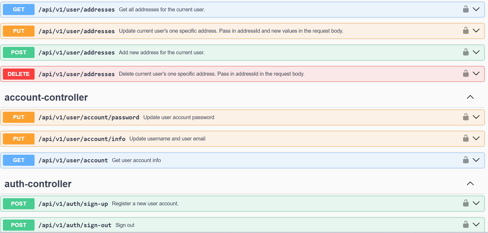
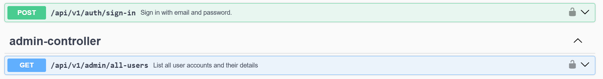
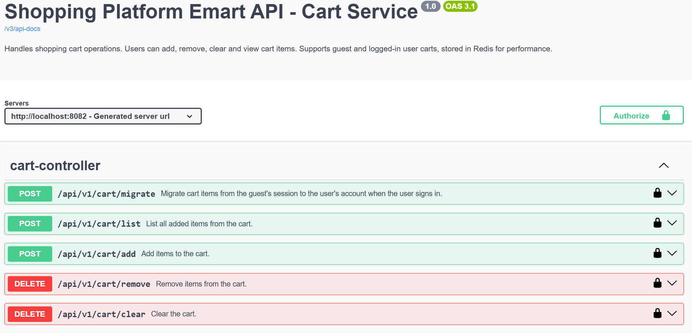
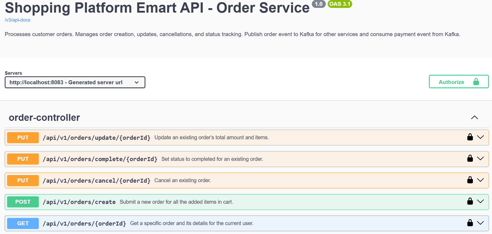
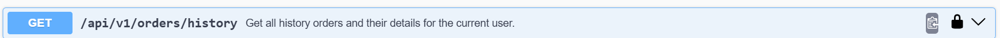

Run docker-compose up -d  in root directory

http://localhost:8080/swagger-ui/index.html - account-service

http://localhost:8081/swagger-ui/index.html - item-service

http://localhost:8082/swagger-ui/index.html - cart-service

http://localhost:8083/swagger-ui/index.html - order-service

payment-service WIP

